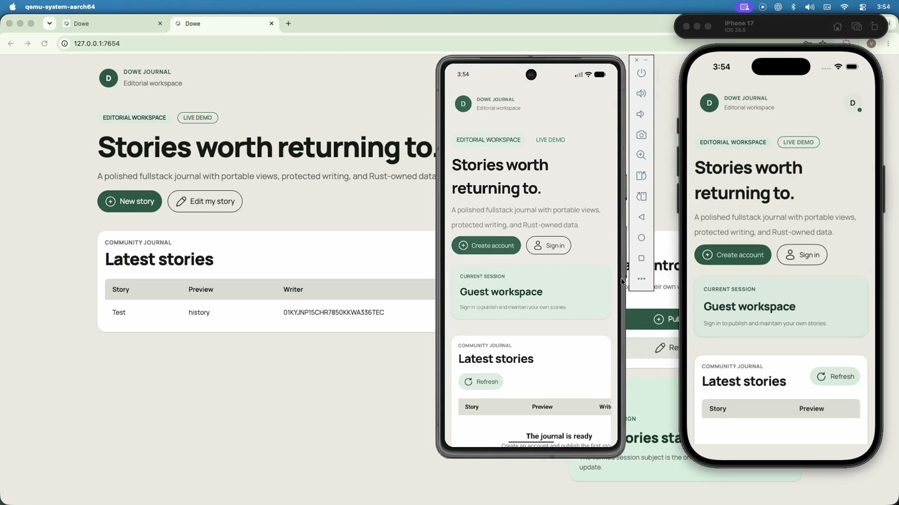
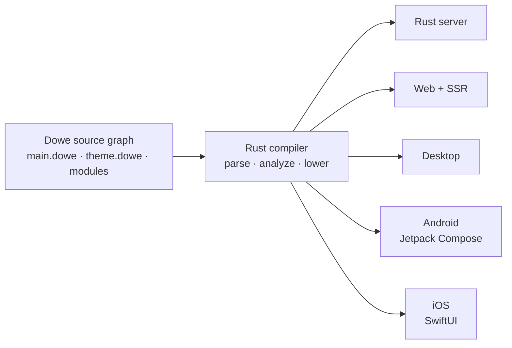

<div align="center">

# Dowe

<p><strong>Fullstack systems for the AI era</strong></p>

**AI can generate code. Dowe generates the system.**

[](https://dowe.dev)


[Website](https://dowe.dev) · [Quick start](#quick-start) · [Architecture](#how-dowe-works) · [Development](#developing-dowe)

<a href="https://cdn.dowe.dev/dowe.mp4">
  
</a>

[**▶ Watch the Dowe demo**](https://cdn.dowe.dev/dowe.mp4)

</div>

---

## What is Dowe?

Dowe is a Rust compiler and runtime toolchain for building fullstack products from a unified,
declarative source graph. Applications are authored in **Dowe Source Format** (`.dowe`), checked
against explicit language and platform contracts, and lowered into the artifacts required by each
selected target.

The result is one product architecture across:

- **Server** — Rust-owned routing, data access, host capabilities, and production serving.
- **Web** — server-rendered HTML, deterministic JavaScript and CSS chunks, and a Rust HTTP router.
- **Desktop** — generated web/static output hosted in native windows for macOS, Windows, and Linux.
- **Android** — native Jetpack Compose projects.
- **iOS** — native SwiftUI projects.

Dowe Source Format is a compiler input, not a JavaScript application runtime. Dowe does not require
Node.js, `node_modules`, React, Tailwind, or execution of user source to compile and run an
application.

## Why Dowe?

| Principle | What it means |
| --- | --- |
| **Architecture is enforced** | Parsing, analysis, routing, runtime behavior, and target generation have explicit owners. |
| **One system, many surfaces** | Server, web, desktop, Android, and iOS share one product model instead of diverging into separate stacks. |
| **Output is deterministic** | Unchanged inputs produce stable generated artifacts that can be inspected, tested, and regenerated. |
| **Boundaries are explicit** | Server-only capabilities and secrets stay out of generated client data. |
| **Agents work inside contracts** | Diagnostics, generated type support, Agent Harnesses, and CodeGraph make constraints machine-readable. |

## How Dowe works



Every project begins with a small set of root contracts:

| Path | Responsibility |
| --- | --- |
| `main.dowe` | Application metadata, views, server wiring, and enabled target families. |
| `theme.dowe` | Fonts, semantic themes, and project-wide component defaults. |
| `.env.example` | Shareable environment variable names and non-secret examples. |
| `.env` | Ignored local values. |
| `views/` | Route graphs, layouts, pages, components, stores, and view-only types. |
| `server/` | Endpoints, handlers, middleware, services, repositories, tasks, and providers. |
| `.dowe/` | Generated development and distribution artifacts. Never edit these as source. |

### Dowe Source Format

```dowe
import ApiRoutes from "@/server/endpoints"
import AppRoutes from "@/views/routes/app"

main
  app name:"Hello Dowe" bundle:"dev.dowe.hello"
  views:AppRoutes
  server port:8080
    endpoints:ApiRoutes
```

```dowe
page HomePage
  Section
    Title
      "Build the system, not the stack."
    Text color:"muted"
      "One source model. Every product surface."
    Button href:"/docs"
      "Explore Dowe"
```

The syntax stays intentionally small: declarations, bindings, `key:value` props, and indented
children. The Rust compiler owns validation and reports invalid bindings, props, imports, routes,
types, and target boundaries before generation.

## Quick start

### 1. Install the CLI

macOS and Linux:

```bash
curl -fsSL https://get.dowe.dev/install | bash
```

<details>
<summary>Windows PowerShell</summary>

```powershell
irm https://get.dowe.dev/install.ps1 | iex
```

</details>

Verify the installation:

```bash
dowe version
```

### 2. Initialize a project

```bash
mkdir hello-dowe
cd hello-dowe
dowe init --template blank
```

Use `dowe init --template crud` for the fullstack CRUD starter. Add `--i18n` to either template to
include translation catalogs.

### 3. Start development

```bash
dowe dev --target server --target web
```

Dowe analyzes the project, writes generated files under `.dowe`, and prints the development URLs.
Run `dowe dev` without flags to select available targets interactively.

## CLI at a glance

| Command | Purpose |
| --- | --- |
| `dowe init` | Create a blank or CRUD Dowe project. |
| `dowe dev` | Compile, watch, and run selected development targets. |
| `dowe test` | Discover and run native `.dowe` literal tests. |
| `dowe deploy` | Produce static, Docker, or Cloudflare distributions. |
| `dowe icons` | Generate versioned web, desktop, Android, and iOS icon sets. |
| `dowe agent` | Install or update public authoring guidance for coding agents. |
| `dowe codegraph` | Inspect ownership, dependencies, modularity, and duplication. |
| `dowe database` | Manage Dowe Database instances and data. |
| `dowe cache` | Manage Dowe Cache instances and key-value data. |
| `dowe vector` | Manage Dowe Vector instances and embeddings. |
| `dowe upgrade` | Upgrade through the official release channel. |

## Repository map

This directory is a Cargo workspace. The main responsibilities are grouped as follows:

| Area | Crates and assets |
| --- | --- |
| Language | `compiler`, `components`, and `inference` |
| Runtime | `runtime`, `stdlib`, `spawn`, `crypto`, and `id` |
| Data | `database`, `cache`, and `vector` |
| Targets | `generator_web`, `generator_desktop`, `generator_android`, and `generator_ios` |
| Tooling | `cli`, `deploy`, `icons`, `minifier`, and `ipc` |
| Agent support | `agent`, `agent_harness`, `codegraph`, and `skill-data` |
| Packaged assets | `assets/fonts` and `assets/icons` |

Core behavior belongs in shared crates. CLI and IPC entrypoints remain thin adapters over the same
compiler and runtime APIs.

## Developing Dowe

From this directory:

```bash
cargo build --workspace
cargo test --workspace
cargo fmt --all -- --check
cargo clippy --workspace --all-targets -- -D warnings
```

Run the development CLI directly from the workspace:

```bash
cargo run -p dowe -- version
```

Compiler and runtime changes should preserve the single-owner architecture, include focused tests,
keep generated output deterministic, and validate every affected target. Dowe source and generated
code remain free of runtime Node.js assumptions and framework-specific compatibility layers.

---

<div align="center">

**Build the system, not the stack.**

[dowe.dev](https://dowe.dev) · [Discord](https://discord.gg/N2cww7sP5s) · [X](https://x.com/usedowe) · [info@dowe.dev](mailto:info@dowe.dev)

</div>
